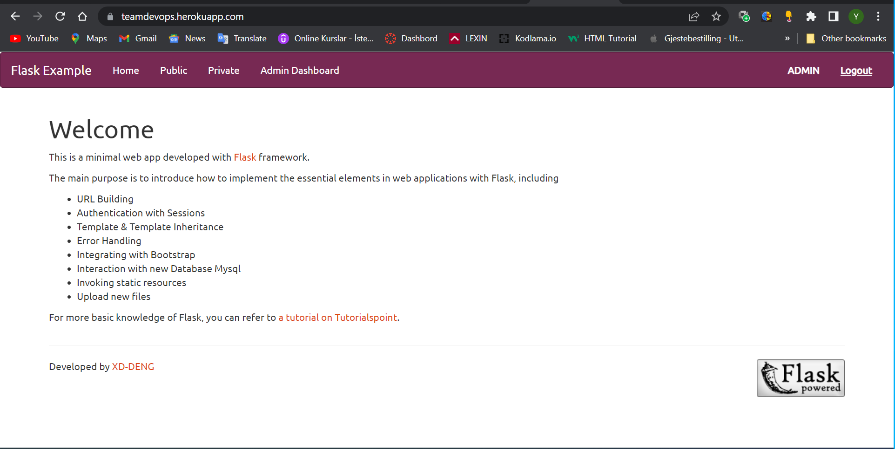
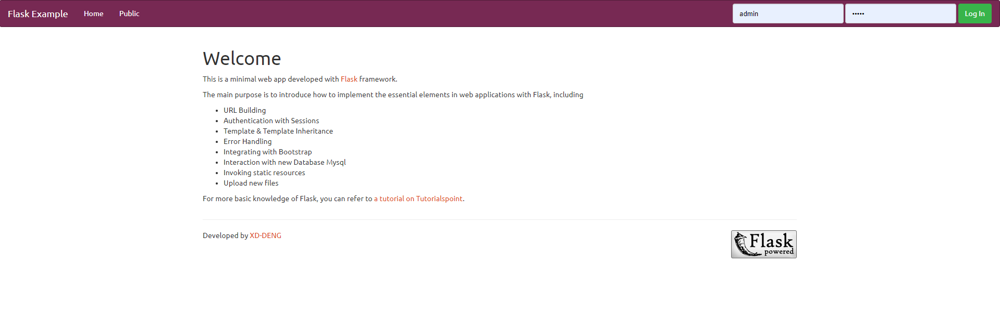

# flask-example

A minimal web app developed with [Flask](http://flask.pocoo.org/) framework.

The main purpose is to introduce how to implement the essential elements in web application with Flask, including

- URL Building

- Authentication with Sessions

- Template & Template Inheritance

- Error Handling

- Integrating with _Bootstrap_

- Interaction with Database (SQLite)

- Invoking static resources

- Interaction with Database (MySQL)

- Selenium Test Automation

- Migration

For more basic knowledge of Flask, you can refer to [a tutorial on Tutorialspoint](https://www.tutorialspoint.com/flask/).

## Requirements

- Python (version 3.9)
- MySQL Server
- Chrome Webdriver
- Flask
- Jinja2
- Werkzeug
- markupsafe>=2.0.1
- mysql-connector>=2.2.9
- Flask_SQLAlchemy>=2.5.1
- pymysql>=1.0.2
- gunicorn
- chromedriver-binary
- selenium
- webdriver_manager
- pytest
- urllib3

## How to Run

- Step 1: Make sure you have Python

- Step 2: Install the requirements: `pip install -r requirements.txt`

- Step 3: Go to this app's directory and run `python app.py`

## Installation

- Step 1: Clone the repository:

git clone https://github.com/yunusy78/flask-example.git

- Step 2: Set up the MySQL database:

  - Create a new database in your MySQL server.
  - Update the database configuration in 'config.py' with your database details.

- Step 3: Install the required Python packages:

  - pip install -r requirements.txt

- Step 4: Run the database migrations:

  - python manage.py db migrate
  - python manage.py db upgrade

- Step 5: ownload and install the Chrome Webdriver from the official website: https://sites.google.com/a/chromium.org/chromedriver/

# Contributing

Contributions are welcome! If you have any suggestions or improvements, please submit a pull request.

## Details about This Toy App

There are three tabs in this toy app

- **Public**: this is a page which can be accessed by anyone, no matter if the user has logged in or not.

- **Private**: Only logged-in user can access this page. Otherwise the user will get a 401 error page.

- **Admin Page**: This part is only open to the user who logged in as "Admin". In this tab, the administrator can manage accounts (list, delete, or add).

A few accounts were set for testing, like **_admin_** (password: admin), **_test_** (password: 123456), etc. You can also delete or add accounts after you log in as **_admin_**.

## References

- http://flask.pocoo.org/

- https://www.tutorialspoint.com/flask/

- http://flask.pocoo.org/

- https://www.tutorialspoint.com/flask/

- https://selenium-python.readthedocs.io/

## Credict

Image private.jpg: https://commons.wikimedia.org/wiki/File:(315-365)_Locked_(6149414678).jpg

Image public.jpg: https://commons.wikimedia.org/wiki/File:Drown%3F!_(131380682).jpg

## Images

-

